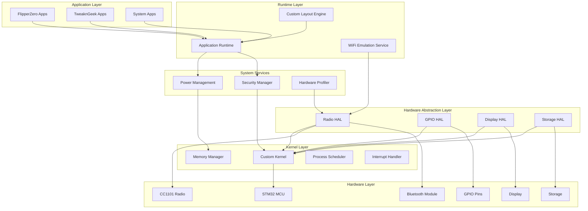

# TweaknGeek Firmware Design Document

## Overview

TweaknGeek is a ground-up custom firmware for the FlipperZero device that provides maximum hardware utilization through both conventional and innovative approaches. The firmware architecture consists of a custom kernel, hardware abstraction layer, application runtime, and advanced hardware manipulation services. The design prioritizes modularity, extensibility, and compatibility while enabling unconventional hardware usage patterns.

## Architecture

### System Architecture Diagram



### Core Components

1. **Custom Kernel**: Manages system resources, process scheduling, and hardware access
2. **Hardware Abstraction Layer (HAL)**: Provides standardized interfaces to hardware components
3. **Application Runtime**: Executes FlipperZero applications with compatibility layer
4. **WiFi Emulation Service**: Repurposes Bluetooth hardware for WiFi-like functionality
5. **Custom Layout Engine**: Manages UI customization and application organization

## Components and Interfaces

### Kernel Layer

**Custom Kernel (TweaknGeek Kernel)**
- **Purpose**: Core system management and hardware control
- **Key Features**:
  - Preemptive multitasking scheduler
  - Memory management with protection
  - Hardware interrupt handling
  - System call interface
- **Interfaces**:
  - `kernel_init()`: Initialize kernel subsystems
  - `process_create()`: Create new process
  - `memory_allocate()`: Allocate protected memory
  - `interrupt_register()`: Register interrupt handlers

**Memory Manager**
- **Purpose**: Manage system memory allocation and protection
- **Key Features**:
  - Heap and stack management
  - Memory protection boundaries
  - Garbage collection for applications
- **Interfaces**:
  - `mem_alloc(size, flags)`: Allocate memory with protection flags
  - `mem_free(ptr)`: Free allocated memory
  - `mem_protect(addr, size, flags)`: Set memory protection

### Hardware Abstraction Layer

**Radio HAL**
- **Purpose**: Unified interface for all radio hardware (CC1101, Bluetooth, etc.)
- **Key Features**:
  - Protocol-agnostic radio control
  - Frequency and power management
  - Custom modulation support
- **Interfaces**:
  - `radio_init(type)`: Initialize radio hardware
  - `radio_transmit(data, freq, power)`: Transmit data
  - `radio_receive(buffer, timeout)`: Receive data
  - `radio_set_mode(mode)`: Set radio operation mode

**GPIO HAL**
- **Purpose**: Flexible GPIO pin management and repurposing
- **Key Features**:
  - Dynamic pin function assignment
  - Interrupt-driven I/O
  - Custom protocol implementation
- **Interfaces**:
  - `gpio_configure(pin, mode, function)`: Configure pin function
  - `gpio_read(pin)`: Read pin state
  - `gpio_write(pin, value)`: Write pin state
  - `gpio_interrupt_enable(pin, callback)`: Enable pin interrupt

### Application Runtime

**Application Runtime Engine**
- **Purpose**: Execute FlipperZero applications with compatibility
- **Key Features**:
  - .fap file loading and execution
  - API compatibility layer
  - Resource management
  - Sandboxing and security
- **Interfaces**:
  - `app_load(path)`: Load application from file
  - `app_execute(app_id)`: Execute loaded application
  - `app_terminate(app_id)`: Terminate running application
  - `api_call(function, params)`: Handle API calls from applications

### Advanced Services

**WiFi Emulation Service**
- **Purpose**: Repurpose Bluetooth hardware for WiFi-like functionality
- **Key Features**:
  - Bluetooth Low Energy protocol manipulation
  - Custom packet crafting
  - Network stack emulation
  - Connection management
- **Interfaces**:
  - `wifi_emu_init()`: Initialize WiFi emulation
  - `wifi_emu_scan()`: Scan for networks
  - `wifi_emu_connect(ssid, key)`: Attempt connection
  - `wifi_emu_send(data)`: Send data packet

**Custom Layout Engine**
- **Purpose**: Manage UI customization and application organization
- **Key Features**:
  - Drag-and-drop interface
  - Custom themes and icons
  - Folder and category management
  - Layout persistence
- **Interfaces**:
  - `layout_init()`: Initialize layout system
  - `layout_create_folder(name)`: Create application folder
  - `layout_move_app(app_id, location)`: Move application
  - `layout_apply_theme(theme_id)`: Apply visual theme

## Data Models

### System Configuration
```c
typedef struct {
    char firmware_version[16];
    char device_name[32];
    uint32_t boot_flags;
    layout_config_t layout;
    security_config_t security;
    hardware_config_t hardware;
} system_config_t;
```

### Application Descriptor
```c
typedef struct {
    uint32_t app_id;
    char name[64];
    char version[16];
    uint32_t memory_size;
    uint32_t permissions;
    app_state_t state;
    void* entry_point;
} app_descriptor_t;
```

### Hardware Resource
```c
typedef struct {
    uint32_t resource_id;
    resource_type_t type;
    uint32_t base_address;
    uint32_t size;
    uint32_t access_flags;
    bool in_use;
    uint32_t owner_process;
} hardware_resource_t;
```

### WiFi Emulation Context
```c
typedef struct {
    uint8_t mac_address[6];
    char ssid[32];
    uint8_t channel;
    int8_t signal_strength;
    connection_state_t state;
    uint8_t packet_buffer[256];
    uint16_t packet_length;
} wifi_emu_context_t;
```

## Error Handling

### Error Classification
1. **Critical Errors**: System crashes, hardware failures
2. **Runtime Errors**: Application crashes, resource exhaustion
3. **Hardware Errors**: Radio failures, GPIO malfunctions
4. **Security Errors**: Unauthorized access, permission violations

### Error Handling Strategy

**Watchdog System**
- Hardware and software watchdogs monitor system health
- Automatic recovery from system hangs
- Diagnostic logging before recovery

**Graceful Degradation**
- Disable non-critical features on hardware failure
- Fallback to safe modes for critical operations
- User notification of reduced functionality

**Error Logging**
```c
typedef struct {
    uint32_t timestamp;
    error_level_t level;
    error_code_t code;
    char message[128];
    uint32_t context_data;
} error_log_entry_t;
```

**Recovery Mechanisms**
- Automatic application restart on crash
- Hardware reset and re-initialization
- Safe mode boot for critical failures
- User-initiated factory reset option

## Testing Strategy

### Unit Testing
- **Kernel Functions**: Memory management, process scheduling
- **HAL Components**: Hardware interface validation
- **Application Runtime**: API compatibility and sandboxing
- **WiFi Emulation**: Protocol handling and packet processing

### Integration Testing
- **Hardware Integration**: Real hardware testing on FlipperZero device
- **Application Compatibility**: Testing with existing FlipperZero apps
- **System Stability**: Long-running stress tests
- **Power Management**: Battery life and thermal testing

### Hardware-in-the-Loop Testing
- **Radio Testing**: RF compliance and performance validation
- **GPIO Testing**: Custom hardware interface validation
- **Bluetooth/WiFi Emulation**: Network protocol testing
- **Security Testing**: Penetration testing and vulnerability assessment

### Performance Testing
- **Boot Time**: Measure and optimize startup performance
- **Memory Usage**: Monitor and optimize memory consumption
- **Radio Performance**: Validate RF transmission quality
- **Application Performance**: Benchmark application execution speed

## Security Considerations

### Secure Boot
- Cryptographic verification of firmware integrity
- Custom key management for signature validation
- Rollback protection against downgrade attacks

### Application Sandboxing
- Memory isolation between applications
- Permission-based hardware access control
- API call validation and filtering

### Hardware Security
- Secure storage for cryptographic keys
- Hardware random number generation
- Tamper detection and response

## Implementation Phases

### Phase 1: Core Kernel and HAL
- Custom kernel implementation
- Basic hardware abstraction layer
- Memory management and process scheduling

### Phase 2: Application Runtime
- FlipperZero API compatibility layer
- Application loading and execution
- Basic UI and input handling

### Phase 3: Advanced Features
- WiFi emulation service
- Custom layout engine
- Hardware profiling tools

### Phase 4: Optimization and Testing
- Performance optimization
- Comprehensive testing
- Security hardening
- Documentation and user guides